# Building a Nano Mixture-of-Experts (MoE) Language Model in JAX from Scratch

*A beginner-friendly deep-dive into how Mixture-of-Experts works, why it matters, and how to build one in pure JAX/Flax.*

**TL;DR:** We built [nano-moe-jax](https://pypi.org/project/nano-moe-jax/) — a lightweight, educational MoE transformer that trains character-level language models on a single GPU. Install it with `pip install nano-moe-jax` and train on Shakespeare in one command.

---

## Table of Contents

1. [What is Mixture of Experts?](#1-what-is-mixture-of-experts)
2. [Why MoE Matters](#2-why-moe-matters)
3. [Architecture Overview](#3-architecture-overview)
4. [The Building Blocks — Layer by Layer](#4-the-building-blocks--layer-by-layer)
5. [The Router — The Brain of MoE](#5-the-router--the-brain-of-moe)
6. [Load Balancing — Preventing Expert Collapse](#6-load-balancing--preventing-expert-collapse)
7. [Putting It All Together — The Full Model](#7-putting-it-all-together--the-full-model)
8. [Training Pipeline](#8-training-pipeline)
9. [Results — Training on Shakespeare](#9-results--training-on-shakespeare)
10. [Code Walkthrough](#10-code-walkthrough)
11. [Key Takeaways](#11-key-takeaways)
12. [Try It Yourself](#12-try-it-yourself)

---

## 1. What is Mixture of Experts?

Imagine you have a team of specialists. Instead of asking *every* specialist to look at every problem, you have a **manager** who looks at each problem and says *"Expert #2 and Expert #4, you're the best fit for this — handle it."*

That's exactly how Mixture of Experts (MoE) works in neural networks:

- **Experts** = independent neural networks (typically small feed-forward networks)
- **Router/Gate** = a learned module that decides which experts to use for each input
- **Sparse activation** = only a *subset* of experts run for each token

```mermaid
graph LR
    subgraph Input
        T1["Token: 'Hello'"]
        T2["Token: 'World'"]
    end

    R["🧠 Router"]

    subgraph Experts
        E1["Expert 1<br/>Language"]
        E2["Expert 2<br/>Punctuation"]
        E3["Expert 3<br/>Names"]
        E4["Expert 4<br/>Verbs"]
    end

    T1 --> R
    T2 --> R
    R -->|"score: 0.7"| E1
    R -->|"score: 0.3"| E4
    R -.->|"not selected"| E2
    R -.->|"not selected"| E3

    style E2 fill:#555,stroke:#888,color:#aaa
    style E3 fill:#555,stroke:#888,color:#aaa
    style E1 fill:#2d6a4f,stroke:#40916c,color:#fff
    style E4 fill:#2d6a4f,stroke:#40916c,color:#fff
```

> **Key Insight:** In a standard transformer, *every* parameter is used for *every* token. In MoE, the model has many more total parameters, but only activates a *fraction* of them per token. This means **more capacity** without a proportional increase in **compute cost**.

---

## 2. Why MoE Matters

MoE is the architecture behind some of the most powerful AI models today:

| Model | Total Params | Active Params | Experts |
|-------|-------------|--------------|---------|
| Mixtral 8x7B | 46.7B | 12.9B | 8 |
| GPT-4 (rumored) | ~1.8T | ~280B | 16 |
| Switch Transformer | 1.6T | ~100B | 128 |
| DeepSeek-V3 | 671B | 37B | 256 |

Notice the pattern: **total parameters are 3–16× larger than active parameters**. This is the "free lunch" of MoE — you get a bigger model that runs as fast as a smaller one.

### The Three Advantages

```mermaid
graph TD
    MoE["🏗️ Mixture of Experts"]
    A["📈 More Capacity<br/>Total params can be<br/>massive (trillions)"]
    B["⚡ Same Compute<br/>Only top-K experts run,<br/>so FLOPs stay low"]
    C["🎯 Specialization<br/>Experts learn to handle<br/>different types of inputs"]

    MoE --> A
    MoE --> B
    MoE --> C

    style MoE fill:#1a1a2e,stroke:#16213e,color:#e94560
    style A fill:#0f3460,stroke:#16213e,color:#fff
    style B fill:#0f3460,stroke:#16213e,color:#fff
    style C fill:#0f3460,stroke:#16213e,color:#fff
```

---

## 3. Architecture Overview

Our NanoMoE is a **GPT-style autoregressive transformer** where the standard FFN layer in each transformer block is replaced with a **MoE layer**.

Here's the full architecture:

```mermaid
graph TB
    Input["📝 Input Tokens<br/>(batch, seq_len)"] --> TokEmb["Token Embedding<br/>vocab_size → d_model"]
    TokEmb --> PosEmb["+ Positional Embedding<br/>Learned, (1, block_size, d_model)"]
    PosEmb --> Drop["Dropout"]
    Drop --> TB1

    subgraph TB1["Transformer Block 1"]
        direction TB
        LN1_1["LayerNorm"] --> ATTN1["Multi-Head Causal<br/>Self-Attention"]
        ATTN1 --> RES1["+ Residual"]
        RES1 --> LN2_1["LayerNorm"]
        LN2_1 --> MOE1["🔀 MoE Layer"]
        MOE1 --> RES2_1["+ Residual"]
    end

    TB1 --> TB2["Transformer Block 2<br/>... (same structure)"]
    TB2 --> TBN["Transformer Block N<br/>... (same structure)"]

    TBN --> FinalLN["LayerNorm"]
    FinalLN --> Head["Linear Head<br/>d_model → vocab_size"]
    Head --> Logits["📊 Logits<br/>(batch, seq_len, vocab_size)"]

    style Input fill:#1a1a2e,stroke:#16213e,color:#e94560
    style Logits fill:#1a1a2e,stroke:#16213e,color:#e94560
    style MOE1 fill:#2d6a4f,stroke:#40916c,color:#fff
```

### Default Hyperparameters

| Parameter | Value | What it controls |
|-----------|-------|-----------------|
| `d_model` | 128 | Size of every hidden vector |
| `n_layers` | 4 | Number of transformer blocks stacked |
| `n_heads` | 4 | Attention heads (each sees 32-dim slice) |
| `d_ff` | 512 | Inner dimension of each expert FFN |
| `n_experts` | 4 | Total expert FFNs per MoE layer |
| `top_k` | 2 | How many experts activate per token |
| `block_size` | 128 | Maximum context window |
| `vocab_size` | 65 | Characters in Shakespeare (a-z, A-Z, etc.) |

**Total parameters: 2,409,025** — small enough to train on a laptop CPU in under an hour!

---

## 4. The Building Blocks — Layer by Layer

### 4.1 Expert Feed-Forward Network (FFN)

Each expert is a simple two-layer MLP. Nothing fancy — just a projection up, a non-linearity, and a projection back down:

```mermaid
graph LR
    X["Input<br/>(d_model = 128)"] --> UP["Dense<br/>128 → 512"]
    UP --> GELU["GELU<br/>Activation"]
    GELU --> DOWN["Dense<br/>512 → 128"]
    DOWN --> Y["Output<br/>(d_model = 128)"]

    style X fill:#264653,stroke:#2a9d8f,color:#fff
    style Y fill:#264653,stroke:#2a9d8f,color:#fff
    style GELU fill:#e76f51,stroke:#f4a261,color:#fff
```

**In code:**

```python
class ExpertFFN(nn.Module):
    d_ff: int      # 512 — inner dimension
    d_model: int   # 128 — outer dimension

    @nn.compact
    def __call__(self, x):
        x = nn.Dense(self.d_ff)(x)    # 128 → 512
        x = nn.gelu(x)                 # non-linearity
        x = nn.Dense(self.d_model)(x)  # 512 → 128
        return x
```

> **Why GELU?** GELU (Gaussian Error Linear Unit) is smoother than ReLU and is the standard activation in modern transformers (GPT-2, BERT, etc.). It provides better gradient flow during training.

### 4.2 Multi-Head Causal Self-Attention

This is the standard transformer attention mechanism. Each token attends to all *previous* tokens (causal = can't look into the future):

```mermaid
graph TB
    X["Input (B, T, D)"] --> QKV["Linear Projection<br/>D → 3D (Q, K, V)"]
    QKV --> Split["Split into Q, K, V"]

    Split --> Q["Q: (B, H, T, d_head)"]
    Split --> K["K: (B, H, T, d_head)"]
    Split --> V["V: (B, H, T, d_head)"]

    Q --> Dot["Q × Kᵀ / √d_head"]
    K --> Dot

    Dot --> Mask["Apply Causal Mask<br/>(upper triangular → -∞)"]
    Mask --> SM["Softmax"]
    SM --> DropA["Dropout"]
    DropA --> Weighted["× V"]
    V --> Weighted

    Weighted --> Concat["Reshape & Concatenate<br/>Heads → (B, T, D)"]
    Concat --> OutProj["Output Projection<br/>D → D"]
    OutProj --> Y["Output (B, T, D)"]

    style X fill:#264653,stroke:#2a9d8f,color:#fff
    style Y fill:#264653,stroke:#2a9d8f,color:#fff
    style Mask fill:#e76f51,stroke:#f4a261,color:#fff
```

The **causal mask** is what makes this a *language model* — position 5 can see positions 1-5 but not 6+. This looks like:

```
Position:  1  2  3  4  5
Token 1:   ✓  ✗  ✗  ✗  ✗
Token 2:   ✓  ✓  ✗  ✗  ✗
Token 3:   ✓  ✓  ✓  ✗  ✗
Token 4:   ✓  ✓  ✓  ✓  ✗
Token 5:   ✓  ✓  ✓  ✓  ✓
```

---

## 5. The Router — The Brain of MoE

The router is what makes MoE *special*. For every token, it decides: **"Which experts should handle this?"**

### How Top-K Routing Works

```mermaid
graph TB
    Token["Token Vector<br/>(d_model = 128)"] --> Linear["Linear Projection<br/>128 → n_experts (4)"]
    Linear --> Logits["Raw Logits<br/>[2.1, -0.5, 3.7, 0.8]"]

    Logits --> TopK["Top-K Selection<br/>(K = 2)"]
    TopK --> Selected["Selected: Expert 3 (3.7), Expert 1 (2.1)"]

    Selected --> Softmax["Softmax over selected<br/>[0.17, 0.83] → normalized gates"]

    Softmax --> G1["Gate 1: 0.17<br/>→ Expert 1"]
    Softmax --> G3["Gate 3: 0.83<br/>→ Expert 3"]

    style Token fill:#264653,stroke:#2a9d8f,color:#fff
    style TopK fill:#e76f51,stroke:#f4a261,color:#fff
    style G1 fill:#2d6a4f,stroke:#40916c,color:#fff
    style G3 fill:#2d6a4f,stroke:#40916c,color:#fff
```

**Step by step:**

1. **Project** the token into `n_experts` logits using a learned linear layer
2. **Top-K** selects the 2 highest-scoring experts
3. **Softmax** normalizes *only* over the selected experts (so gates sum to 1.0)
4. Each selected expert **processes the full token independently**
5. The outputs are **weighted** by the gate values and **summed**

```python
# Simplified routing logic
logits = nn.Dense(n_experts)(token)              # [2.1, -0.5, 3.7, 0.8]
top_values, top_indices = jax.lax.top_k(logits, k=2)  # [3.7, 2.1], [2, 0]
gates = jax.nn.softmax(top_values)                # [0.83, 0.17]

# Run selected experts and combine
output = gates[0] * expert_3(token) + gates[1] * expert_1(token)
```

---

## 6. Load Balancing — Preventing Expert Collapse

Here's the #1 failure mode of MoE: **expert collapse**. Without careful training, the router learns to send *all* tokens to one or two experts, while the others sit idle and never learn anything useful.

```mermaid
graph LR
    subgraph Bad["❌ Expert Collapse"]
        direction TB
        R1["Router sends<br/>95% of tokens"] --> E1_bad["Expert 1<br/>Overloaded 😰"]
        R1 -->|"5%"| E2_bad["Expert 2<br/>Barely used 😴"]
        R1 -.->|"0%"| E3_bad["Expert 3<br/>Dead 💀"]
        R1 -.->|"0%"| E4_bad["Expert 4<br/>Dead 💀"]
    end

    subgraph Good["✅ Balanced Routing"]
        direction TB
        R2["Router distributes<br/>tokens evenly"] -->|"25%"| E1_good["Expert 1 🟢"]
        R2 -->|"25%"| E2_good["Expert 2 🟢"]
        R2 -->|"25%"| E3_good["Expert 3 🟢"]
        R2 -->|"25%"| E4_good["Expert 4 🟢"]
    end

    style Bad fill:#3d0000,stroke:#ff0000,color:#fff
    style Good fill:#003d00,stroke:#00ff00,color:#fff
```

### The Auxiliary Load-Balancing Loss

To prevent this, we add a **load-balancing loss** (from the [Switch Transformer paper](https://arxiv.org/abs/2101.03961)):

```
aux_loss = n_experts × Σᵢ (fᵢ × Pᵢ)
```

Where:
- **fᵢ** = fraction of tokens routed to expert i (how many tokens actually go there)
- **Pᵢ** = mean routing probability for expert i (how likely the router *thinks* it should send tokens there)
- The product fᵢ × Pᵢ is minimized when routing is **uniform**

The total training loss becomes:

```
total_loss = cross_entropy_loss + α × aux_loss
```

Where `α = 0.01` (small enough to not dominate training, large enough to prevent collapse).

```mermaid
graph LR
    CE["Cross-Entropy Loss<br/>(language modeling)"] --> Plus["+"]
    AUX["α × Auxiliary Loss<br/>(load balancing)"] --> Plus
    Plus --> Total["Total Loss<br/>= CE + 0.01 × Aux"]

    style CE fill:#264653,stroke:#2a9d8f,color:#fff
    style AUX fill:#e76f51,stroke:#f4a261,color:#fff
    style Total fill:#1a1a2e,stroke:#16213e,color:#e94560
```

---

## 7. Putting It All Together — The Full Model

Here's the complete data flow through NanoMoE, showing exactly how a token gets processed from input to prediction:

```mermaid
graph TB
    subgraph INPUT["Input Processing"]
        Tokens["Integer Tokens<br/>[15, 42, 7, ...]"] --> TokEmb["Token Embedding Table<br/>65 × 128"]
        TokEmb --> Add["+ Position Embedding<br/>128 × 128"]
        Add --> DropI["Dropout (0.1)"]
    end

    subgraph BLOCK["Transformer Block (×4)"]
        direction TB
        subgraph ATTN_SUB["Self-Attention Sub-layer"]
            LN1["LayerNorm"] --> MHA["Multi-Head Attention<br/>4 heads × 32 dim"]
            MHA --> Drop1["Dropout"]
        end

        DropI2["Input"] --> LN1
        Drop1 --> Res1["+ Residual"]
        DropI2 --> Res1

        subgraph MOE_SUB["MoE Sub-layer"]
            LN2["LayerNorm"] --> Router["Router<br/>128 → 4 logits"]
            Router --> TopK2["Top-2 Selection"]
            TopK2 --> E1["Expert 1<br/>128→512→128"]
            TopK2 --> E2["Expert 2<br/>128→512→128"]
            E1 --> WeightedSum["Weighted Sum<br/>g₁·E₁ + g₂·E₂"]
            E2 --> WeightedSum
            WeightedSum --> Drop2["Dropout"]
        end

        Res1 --> LN2
        Drop2 --> Res2["+ Residual"]
        Res1 --> Res2
    end

    subgraph OUTPUT["Output Head"]
        FinalLN["LayerNorm"] --> LMHead["Linear<br/>128 → 65"]
        LMHead --> Softmax["Softmax"]
        Softmax --> Pred["Predicted Next Token"]
    end

    DropI --> DropI2
    Res2 --> FinalLN

    style Router fill:#e76f51,stroke:#f4a261,color:#fff
    style WeightedSum fill:#2d6a4f,stroke:#40916c,color:#fff
    style Pred fill:#1a1a2e,stroke:#16213e,color:#e94560
```

### The Pre-Norm Pattern

Notice we use **pre-norm** (LayerNorm *before* the sub-layer) rather than post-norm (LayerNorm *after*). This is the modern standard because:

1. **Better gradient flow** — gradients pass through the residual connection unmodified
2. **More stable training** — especially important for MoE where routing can cause instability
3. **Used by GPT-2, LLaMA, Mistral, etc.** — it's the de facto standard

```
Pre-norm:   output = x + SubLayer(LayerNorm(x))     ← we use this
Post-norm:  output = LayerNorm(x + SubLayer(x))      ← original transformer
```

---

## 8. Training Pipeline

### The Training Loop

```mermaid
graph TB
    subgraph Loop["Training Step (JIT-compiled)"]
        direction TB
        Batch["Sample Random Batch<br/>(32 × 128 tokens)"] --> Forward["Forward Pass<br/>logits, aux_loss = model(x)"]
        Forward --> CELoss["Cross-Entropy Loss<br/>between logits and targets"]
        Forward --> AuxLoss["Auxiliary Load-Balance Loss<br/>from all 4 MoE layers"]
        CELoss --> TotalLoss["Total Loss<br/>CE + 0.01 × Aux"]
        AuxLoss --> TotalLoss
        TotalLoss --> Backward["Backward Pass<br/>jax.grad()"]
        Backward --> Update["AdamW Update<br/>lr=3e-4, wd=0.1"]
    end

    Update --> NextStep["Next Step →"]

    style TotalLoss fill:#e76f51,stroke:#f4a261,color:#fff
    style Update fill:#2d6a4f,stroke:#40916c,color:#fff
```

### Why JAX?

Our entire training step — forward pass, loss computation, backpropagation, and optimizer update — is wrapped in `@jax.jit`, which means:

1. **First call**: JAX traces the computation, compiles it to XLA
2. **All subsequent calls**: Run the pre-compiled kernel at maximum speed
3. **Automatic differentiation**: `jax.grad` handles backprop through the entire MoE routing

```python
@jax.jit
def train_step(state, x, y):
    def loss_fn(params):
        logits, aux_loss = model.apply({"params": params}, x)
        ce_loss = cross_entropy(logits, y)
        return ce_loss + 0.01 * aux_loss      # combined loss

    grads = jax.grad(loss_fn)(state.params)    # automatic differentiation!
    state = state.apply_gradients(grads=grads)  # optimizer step
    return state
```

---

## 9. Results — Training on Shakespeare

We trained NanoMoE on **Tiny Shakespeare** (~1.1M characters) for 5,000 steps. Here are the actual training metrics:

### Loss Curve

| Step | Train Loss | CE Loss | Aux Loss | Val Loss |
|------|-----------|---------|----------|----------|
| 1 | 4.2320 | 4.1814 | 5.0571 | 4.0883 |
| 250 | 2.5591 | 2.5189 | 4.0237 | 2.5524 |
| 500 | 2.4495 | 2.4094 | 4.0153 | 2.4223 |
| 1000 | 2.1410 | 2.1006 | 4.0342 | 2.0771 |
| 2000 | 1.7739 | 1.7337 | 4.0254 | 1.8537 |
| 3000 | 1.6949 | 1.6547 | 4.0210 | 1.7669 |
| 4000 | 1.6298 | 1.5894 | 4.0372 | 1.7035 |
| 5000 | **1.5395** | **1.4992** | 4.0250 | **1.6584** |

### Key Observations

```mermaid
graph LR
    subgraph Results["📊 Training Results"]
        direction TB
        A["Loss: 4.23 → 1.54<br/>63% reduction ✅"]
        B["Aux Loss: ~4.02<br/>Stable = experts balanced ✅"]
        C["Train-Val Gap: 0.12<br/>Minimal overfitting ✅"]
        D["2.4M params trained<br/>in ~4h on CPU ✅"]
    end

    style Results fill:#0f3460,stroke:#16213e,color:#fff
```

**Observations:**

1. **The loss drops dramatically early** (4.23 → 2.55 in just 250 steps), then continues to improve steadily
2. **The auxiliary loss stays around 4.0** throughout — this means the load-balancing loss is working and experts are being used roughly equally (for 4 experts, the theoretical balanced value is exactly 4.0!)
3. **The train-val gap is small** (~0.12), indicating minimal overfitting even with a relatively small dataset
4. **A 2.4M parameter model** achieves reasonable character-level generation quality

---

## 10. Code Walkthrough

### Project Structure

```
MoE-JAX/
├── nano_moe/
│   ├── __init__.py        # Public API exports
│   ├── config.py          # NanoMoEConfig dataclass
│   ├── layers.py          # ExpertFFN, Router, MoELayer,
│   │                      # MultiHeadAttention, TransformerBlock
│   ├── model.py           # NanoMoE model + generate()
│   ├── train.py           # Training loop, JIT steps
│   └── utils.py           # Data loading, batching
├── examples/
│   └── train_shakespeare.py
├── tests/
│   ├── test_layers.py     # 8 layer tests
│   └── test_model.py      # 5 model tests
├── .github/
│   └── workflows/
│       └── publish.yml    # Auto-publish to PyPI
├── pyproject.toml
├── requirements.txt
├── LICENSE                # MIT
└── README.md
```

### How the MoE Layer Works (Simplified)

The most important piece — here's a simplified view of how `MoELayer.__call__` works:

```python
def __call__(self, x):  # x shape: (batch, seq_len, d_model)

    # Step 1: Route — find the best 2 experts for each token
    gates, indices, aux_loss = Router(n_experts=4, top_k=2)(x)
    # gates:   (batch, seq_len, 2) — softmax weights
    # indices: (batch, seq_len, 2) — which experts

    # Step 2: Run ALL experts (nano-scale, so this is fine)
    expert_outputs = [expert(x) for expert in experts]  # 4 × (B, T, D)
    expert_outputs = jnp.stack(expert_outputs)           # (4, B, T, D)

    # Step 3: Pick the outputs of the selected experts
    selected = expert_outputs[indices]  # (B, T, 2, D)

    # Step 4: Weighted combination
    output = sum(gates * selected)  # (B, T, D)

    return output, aux_loss
```

### Generation — Autoregressive Sampling

After training, we generate text one character at a time:


```python
# Temperature controls randomness (lower = more deterministic)
logits = logits / temperature

# Top-k filtering removes unlikely tokens
top_vals, _ = jax.lax.top_k(logits, k=40)
logits = jnp.where(logits < top_vals[:, -1:], -inf, logits)

# Sample from the filtered distribution
next_token = jax.random.categorical(rng, logits)
```

---

## 11. Key Takeaways

### What You Learned

1. **MoE = Many Experts + Smart Router** — The router learns which expert handles which type of input
2. **Sparse Activation is the key** — Only top-K experts run per token, so compute stays constant even as you add more experts
3. **Load balancing is critical** — Without the auxiliary loss, experts collapse (some get all traffic, others die)
4. **JAX makes this clean** — `jax.jit` for speed, `jax.grad` for automatic differentiation through complex routing
5. **Pre-norm + residual connections** are essential for stable training

### Dense vs. MoE Comparison

```mermaid
graph TB
    subgraph Dense["Dense Transformer (Standard)"]
        direction LR
        D_In["Token"] --> D_FFN["One Big FFN<br/>128 → 512 → 128"]
        D_FFN --> D_Out["Output"]
    end

    subgraph MoE_Model["MoE Transformer (Ours)"]
        direction LR
        M_In["Token"] --> M_Router["Router"]
        M_Router -->|"0.6"| M_E1["Expert 1"]
        M_Router -->|"0.4"| M_E3["Expert 3"]
        M_E1 --> M_Sum["Weighted<br/>Sum"]
        M_E3 --> M_Sum
        M_Sum --> M_Out["Output"]
    end

    Note1["Dense: 131K params, ALL active"]
    Note2["MoE: 524K params, 262K active<br/>4× capacity, same compute!"]

    Dense ~~~ Note1
    MoE_Model ~~~ Note2

    style Dense fill:#264653,stroke:#2a9d8f,color:#fff
    style MoE_Model fill:#2d6a4f,stroke:#40916c,color:#fff
    style Note1 fill:#1a1a2e,stroke:#16213e,color:#aaa
    style Note2 fill:#1a1a2e,stroke:#16213e,color:#e94560
```

### What to Explore Next

- **Scale up** — Try more experts (8, 16), deeper models, larger datasets
- **Expert parallelism** — Distribute experts across multiple GPUs
- **Learned routing** — Experiment with different gating mechanisms (hash routing, soft routing)
- **Token dropping** — What happens when you drop tokens that no expert wants?
- **Fine-grained MoE** — Use many small experts instead of few large ones

---

## 12. Try It Yourself

### Install from PyPI

```bash
pip install nano-moe-jax
```

### Or Clone & Train

```bash
git clone https://github.com/carrycooldude/MoE-JAX.git
cd MoE-JAX
pip install -e .

# Train on Shakespeare (takes ~1h on GPU, ~4h on CPU)
python examples/train_shakespeare.py

# Run tests
python -m pytest tests/ -v
```

### Use as a Library

```python
from nano_moe import NanoMoEConfig, NanoMoE
import jax

# Custom configuration
config = NanoMoEConfig(
    vocab_size=65,
    n_layers=6,         # deeper
    n_experts=8,         # more experts
    top_k=2,             # still activate 2
    d_model=256,         # wider
)

# Initialize
model = NanoMoE(config=config)
rng = jax.random.PRNGKey(42)
params = model.init(rng, jnp.ones((1, 128), dtype=jnp.int32))["params"]

# Forward pass
logits, aux_loss = model.apply({"params": params}, tokens)
```

---

## Resources

- **Repository**: [github.com/carrycooldude/MoE-JAX](https://github.com/carrycooldude/MoE-JAX)
- **PyPI**: [pypi.org/project/nano-moe-jax](https://pypi.org/project/nano-moe-jax/)
- **Switch Transformers Paper**: [arxiv.org/abs/2101.03961](https://arxiv.org/abs/2101.03961)
- **Mixtral Paper**: [arxiv.org/abs/2401.04088](https://arxiv.org/abs/2401.04088)
- **JAX Documentation**: [jax.readthedocs.io](https://jax.readthedocs.io)
- **Flax Documentation**: [flax.readthedocs.io](https://flax.readthedocs.io)

---

*Built with ❤️ using JAX, Flax, and Optax. Star the [repo](https://github.com/carrycooldude/MoE-JAX) if you found this helpful!*
