# Building a Nano Mixture-of-Experts Language Model in JAX from Scratch

A beginner-friendly deep-dive into how Mixture-of-Experts works, why it matters, and how to build one in pure JAX/Flax.

<!-- truncate -->

## What is Mixture of Experts?

Imagine you have a team of specialists. Instead of asking *every* specialist to look at every problem, you have a **manager** who looks at each problem and says *"Expert #2 and Expert #4, you're the best fit for this — handle it."*

```mermaid
graph LR
    T["Token"] --> R["🧠 Router"]
    R -->|"0.7"| E1["Expert 1 🟢"]
    R -->|"0.3"| E4["Expert 4 🟢"]
    R -.->|"skip"| E2["Expert 2"]
    R -.->|"skip"| E3["Expert 3"]
    E1 --> Sum["⊕ Weighted Sum"]
    E4 --> Sum
```



## Why MoE Matters

| Model | Total Params | Active Params | Experts |
|-------|-------------|--------------|---------|
| Mixtral 8x7B | 46.7B | 12.9B | 8 |
| GPT-4 (rumored) | ~1.8T | ~280B | 16 |
| DeepSeek-V3 | 671B | 37B | 256 |

**More capacity. Same compute.** That's the magic of sparse activation.

## Our Architecture

NanoMoE is a GPT-style transformer where the FFN in each block is replaced with a MoE layer:

```mermaid
graph TB
    Input["Tokens"] --> Emb["Embeddings"]
    Emb --> B["4× Transformer Blocks"]
    B --> Head["LM Head"]
    Head --> Out["Predictions"]

    subgraph Block["Each Transformer Block"]
        LN1["LayerNorm"] --> Attn["Multi-Head Attention"]
        Attn --> R1["+Residual"]
        R1 --> LN2["LayerNorm"]
        LN2 --> MoE["🔀 MoE Layer<br/>4 Experts, Top-2"]
        MoE --> R2["+Residual"]
    end
```



### Default Config: 2.4M parameters

| Parameter | Value |
|-----------|-------|
| `d_model` | 128 |
| `n_layers` | 4 |
| `n_heads` | 4 |
| `n_experts` | 4 |
| `top_k` | 2 |

## Top-K Routing — How It Works

```mermaid
graph TB
    Token["Token (128-dim)"] --> Proj["Linear → 4 logits<br/>[2.1, -0.5, 3.7, 0.8]"]
    Proj --> TopK["Top-2: [3.7, 2.1]"]
    TopK --> SM["Softmax: [0.83, 0.17]"]
    SM --> G1["0.83 × Expert 3"]
    SM --> G2["0.17 × Expert 1"]
    G1 --> Sum["⊕ Output"]
    G2 --> Sum
```



1. Project token to `n_experts` logits
2. Select top-K experts
3. Softmax over selected values
4. Weighted combination of expert outputs

## Load Balancing

Without it, MoE collapses — all tokens go to one expert:

```mermaid
graph LR
    subgraph Bad["❌ Collapsed"]
        R1["Router"] -->|"95%"| E1["Expert 1 😰"]
        R1 -.->|"5%"| E2["Others 💀"]
    end
    subgraph Good["✅ Balanced"]
        R2["Router"] -->|"25%"| E1g["Expert 1 🟢"]
        R2 -->|"25%"| E2g["Expert 2 🟢"]
        R2 -->|"25%"| E3g["Expert 3 🟢"]
        R2 -->|"25%"| E4g["Expert 4 🟢"]
    end
```



**Solution:** Auxiliary loss from the Switch Transformer paper:

```
total_loss = CE_loss + 0.01 × aux_loss
```

## Training Results

We trained on Tiny Shakespeare for 5,000 steps:

| Step | Train Loss | Val Loss |
|------|-----------|----------|
| 1 | 4.23 | 4.09 |
| 1000 | 2.14 | 2.08 |
| 3000 | 1.69 | 1.77 |
| 5000 | **1.54** | **1.66** |

✅ Loss dropped **64%** (4.23 → 1.54)
✅ Aux loss stable at ~4.0 (experts balanced)
✅ Minimal overfitting (gap = 0.12)

## Try It Yourself

```bash
pip install nano-moe-jax
python -c "
from nano_moe import NanoMoEConfig, NanoMoE
import jax, jax.numpy as jnp

model = NanoMoE(config=NanoMoEConfig())
params = model.init(jax.random.PRNGKey(0), jnp.ones((1,32), dtype=jnp.int32))['params']
logits, aux = model.apply({'params': params}, jnp.ones((1,32), dtype=jnp.int32))
print(f'Output: {logits.shape}, Aux loss: {aux:.2f}')
"
```

📖 **Full documentation: [carrycooldude.github.io/Nano-MoE-JAX](https://carrycooldude.github.io/Nano-MoE-JAX/)**

⭐ **Star the repo: [github.com/carrycooldude/Nano-MoE-JAX](https://github.com/carrycooldude/Nano-MoE-JAX)**
