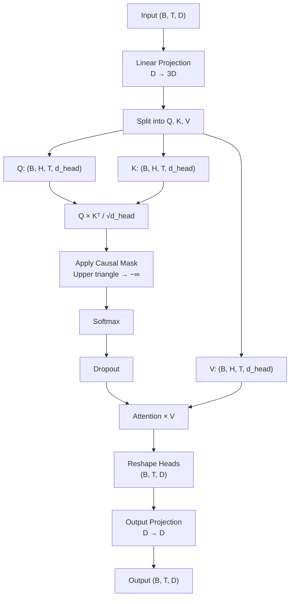
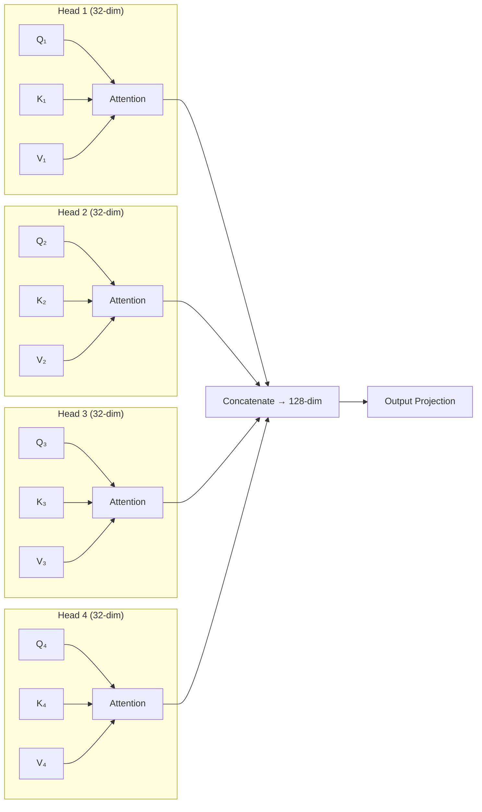

# Multi-Head Causal Self-Attention

The standard transformer attention mechanism. Each token attends to all *previous* tokens (causal masking ensures the model can't look into the future).

## Architecture



## The Causal Mask

The causal mask prevents position `i` from attending to positions `j > i`. This is what makes the model **autoregressive** — each token can only depend on previous tokens:

```
Position:  1   2   3   4   5
Token 1:   ✅  ❌  ❌  ❌  ❌
Token 2:   ✅  ✅  ❌  ❌  ❌
Token 3:   ✅  ✅  ✅  ❌  ❌
Token 4:   ✅  ✅  ✅  ✅  ❌
Token 5:   ✅  ✅  ✅  ✅  ✅
```

In code, we set the upper-triangular entries to `-inf` before softmax, which makes their attention weights effectively zero.

## Multi-Head: Why?

Instead of one big attention operation, we split `d_model` into `n_heads` independent heads:

| Parameter | Value |
|-----------|-------|
| `d_model` | 128 |
| `n_heads` | 4 |
| `d_head` | 128 / 4 = 32 |

Each head can attend to different things — one might track syntax, another semantics, another positional patterns.



## Code

```python
class MultiHeadAttention(nn.Module):
    config: NanoMoEConfig

    @nn.compact
    def __call__(self, x, deterministic=False):
        cfg = self.config
        B, T, D = x.shape
        head_dim = D // cfg.n_heads

        # Project to Q, K, V
        qkv = nn.Dense(3 * D)(x)   # (B, T, 3D)
        q, k, v = jnp.split(qkv, 3, axis=-1)

        # Reshape into heads
        q = q.reshape(B, T, cfg.n_heads, head_dim).transpose(0, 2, 1, 3)
        k = k.reshape(B, T, cfg.n_heads, head_dim).transpose(0, 2, 1, 3)
        v = v.reshape(B, T, cfg.n_heads, head_dim).transpose(0, 2, 1, 3)

        # Scaled dot-product attention
        scale = head_dim ** -0.5
        attn = (q @ k.transpose(0, 1, 3, 2)) * scale

        # Causal mask
        mask = jnp.triu(jnp.ones((T, T)), k=1).astype(bool)
        attn = jnp.where(mask, -1e9, attn)
        attn = jax.nn.softmax(attn, axis=-1)
        attn = nn.Dropout(cfg.dropout)(attn, deterministic=deterministic)

        # Apply attention to values
        out = (attn @ v).transpose(0, 2, 1, 3).reshape(B, T, D)
        return nn.Dense(D)(out)
```
