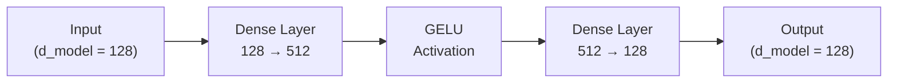

# Expert Feed-Forward Network

Each expert is a simple **two-layer MLP** (Multi-Layer Perceptron). It's the fundamental building block of the MoE layer — there are `n_experts` (default: 4) of these, each with their own independent weights.

## Architecture



## How It Works

| Step | Operation | Shape Change |
|------|-----------|-------------|
| 1 | Dense (up-projection) | `(*, 128)` → `(*, 512)` |
| 2 | GELU activation | `(*, 512)` → `(*, 512)` |
| 3 | Dense (down-projection) | `(*, 512)` → `(*, 128)` |

The up-projection expands the representation to a higher dimension (`d_ff = 512`), applies a non-linearity, then projects back down. This allows the network to learn complex transformations.

## Code

```python
class ExpertFFN(nn.Module):
    """Single expert: two-layer MLP with GELU activation."""
    config: NanoMoEConfig

    @nn.compact
    def __call__(self, x):
        cfg = self.config
        x = nn.Dense(cfg.d_ff)(x)      # 128 → 512
        x = nn.gelu(x)                  # non-linearity
        x = nn.Dense(cfg.d_model)(x)    # 512 → 128
        return x
```

:::tip Why GELU?
**GELU** (Gaussian Error Linear Unit) is smoother than ReLU and is the standard activation in modern transformers (GPT-2, BERT, LLaMA). It provides better gradient flow during training because it doesn't have the "dead neuron" problem of ReLU.
:::

## Parameter Count

Each expert has:
- Up-projection: `d_model × d_ff + d_ff` = `128 × 512 + 512` = **66,048**
- Down-projection: `d_ff × d_model + d_model` = `512 × 128 + 128` = **65,664**
- **Total per expert: ~131K parameters**
- **Total for 4 experts: ~524K parameters**

This is 4× the parameters of a single FFN, but only 2 experts run per token (top-2 routing), so compute is only 2×.
