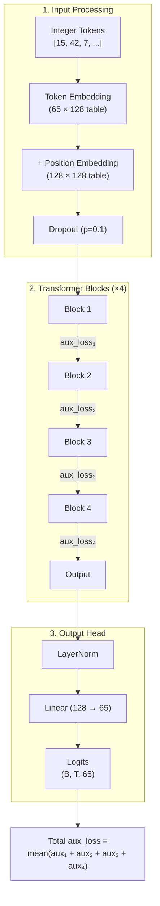
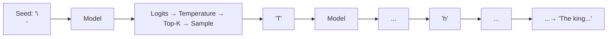

# Full NanoMoE Model

The `NanoMoE` class puts everything together: embeddings → stacked transformer blocks → language model head.

## Complete Data Flow



## Two Outputs

The model's `__call__` returns **two** things:

```python
logits, aux_loss = model.apply({"params": params}, input_tokens)
```

| Output | Shape | Description |
|--------|-------|-------------|
| `logits` | `(batch, seq_len, vocab_size)` | Raw predictions for next token |
| `aux_loss` | scalar | Mean auxiliary load-balancing loss across all layers |

## Autoregressive Generation

After training, the model generates text one token at a time:



The `generate()` method:

```python
def generate(self, params, rng, prompt, max_new_tokens, temperature=0.8, top_k=40):
    tokens = prompt
    for _ in range(max_new_tokens):
        # Crop to context window
        context = tokens[:, -block_size:]

        # Get predictions
        logits, _ = self.apply({"params": params}, context)

        # Sample next token
        logits = logits[:, -1, :] / temperature
        top_vals, _ = jax.lax.top_k(logits, k=top_k)
        logits = jnp.where(logits < top_vals[:, -1:], -1e9, logits)
        next_token = jax.random.categorical(rng, logits)

        tokens = jnp.concatenate([tokens, next_token[:, None]], axis=1)
    return tokens
```

### Generation Parameters

| Parameter | Default | Effect |
|-----------|---------|--------|
| `temperature` | 0.8 | Lower = more deterministic, higher = more creative |
| `top_k` | 40 | Only sample from the top K most likely tokens |
| `max_new_tokens` | 500 | Maximum tokens to generate |
