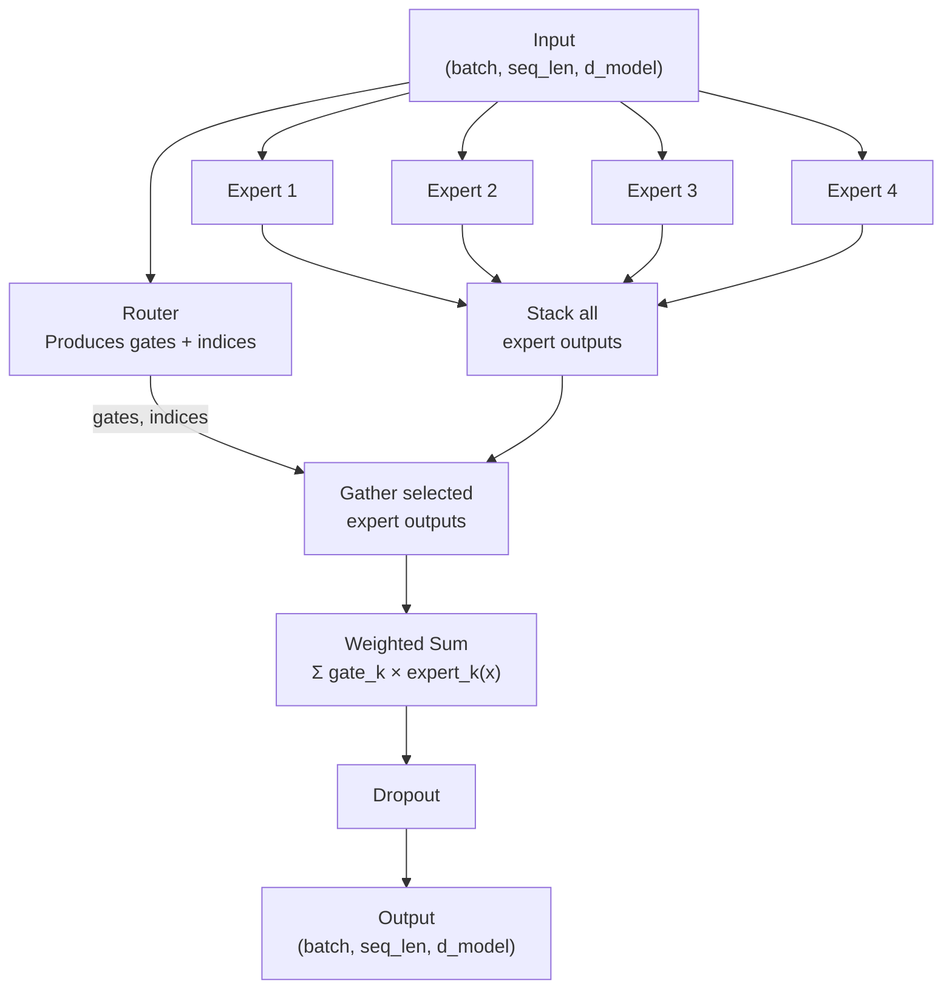
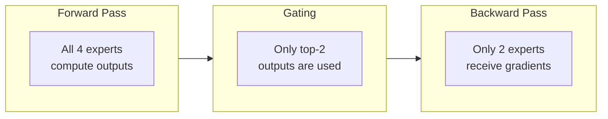

# MoE Layer

The MoE layer replaces the standard FFN in a transformer block. It contains `n_experts` independent expert FFNs and a router that selects which experts to activate.

## How It Works



## Implementation Strategy

In our nano-scale implementation, we run **all** experts on all tokens, then select the outputs of the chosen ones. This is simpler to implement and efficient at our scale:

```python
# 1. Run all experts
expert_outs = jnp.stack([exp(x) for exp in experts])  # (E, B, T, D)

# 2. Router selects top-K
gates, indices, aux_loss = router(x)  # gates: (B,T,K), indices: (B,T,K)

# 3. Gather selected expert outputs
selected = expert_outs[indices]  # fancy indexing → (B, T, K, D)

# 4. Weight and sum
output = (gates[..., None] * selected).sum(axis=-2)  # (B, T, D)
```

:::info Nano vs. Production MoE
In production systems like Mixtral or Switch Transformer, tokens are **physically routed** to specific experts to save memory and compute. In our nano implementation, we run all experts and select afterwards — this is fine for 4 experts but wouldn't scale to 128+.
:::

## What Makes It "Sparse"?

Even though we compute all expert outputs (at nano scale), the **gradient flow is sparse**:



The unselected experts' outputs are multiplied by zero gates, so they receive **zero gradients** through the weighted sum. This means:
- Only selected experts learn from each token
- Different experts specialize on different types of inputs
- The model develops **conditional computation** naturally

## Shape Reference

| Tensor | Shape | Description |
|--------|-------|-------------|
| Input `x` | `(B, T, D)` | Batch of token sequences |
| Expert outputs | `(E, B, T, D)` | All expert outputs stacked |
| Router gates | `(B, T, K)` | Softmax weights for top-K experts |
| Router indices | `(B, T, K)` | Which experts were selected |
| Selected outputs | `(B, T, K, D)` | Gathered expert outputs |
| Final output | `(B, T, D)` | Weighted sum |
| Aux loss | scalar | Load-balancing auxiliary loss |
