# Architecture Overview

NanoMoE is a **GPT-style autoregressive transformer** where the standard FFN in each transformer block is replaced with a **Mixture-of-Experts (MoE) layer**.

## Full Model Architecture

```mermaid
graph TB
    Input["📝 Input Tokens<br/>(batch, seq_len)"] --> TokEmb["Token Embedding<br/>vocab_size → d_model"]
    TokEmb --> PosEmb["+ Positional Embedding<br/>Learned, max_seq_len × d_model"]
    PosEmb --> Drop["Dropout"]

    Drop --> TB1

    subgraph TB1["Transformer Block 1"]
        direction TB
        LN1_1["LayerNorm"] --> ATTN1["Multi-Head Causal<br/>Self-Attention"]
        ATTN1 --> RES1["+ Residual"]
        RES1 --> LN2_1["LayerNorm"]
        LN2_1 --> MOE1["🔀 MoE Layer<br/>4 Experts, Top-2"]
        MOE1 --> RES2_1["+ Residual"]
    end

    TB1 --> TB2["Transformer Block 2"]
    TB2 --> TB3["Transformer Block 3"]
    TB3 --> TB4["Transformer Block 4"]

    TB4 --> FinalLN["LayerNorm"]
    FinalLN --> Head["Linear Head<br/>d_model → vocab_size"]
    Head --> Logits["📊 Logits<br/>(batch, seq_len, vocab_size)"]
```



## Data Flow Summary

1. **Input tokens** (integers) are embedded into dense vectors via a learned embedding table
2. **Positional embeddings** are added so the model knows token order
3. Each **Transformer Block** applies:
   - Self-attention (how tokens relate to each other)
   - MoE layer (expert-routed feed-forward processing)
   - Residual connections + LayerNorm for stability
4. The final **LM head** projects back to vocabulary size for next-token prediction

## The Pre-Norm Pattern

NanoMoE uses **pre-norm** (LayerNorm *before* the sub-layer) rather than post-norm:

```
Pre-norm:   output = x + SubLayer(LayerNorm(x))     ← we use this
Post-norm:  output = LayerNorm(x + SubLayer(x))      ← original transformer
```

:::info Why Pre-Norm?
1. **Better gradient flow** — gradients pass through the residual connection unmodified
2. **More stable training** — especially important for MoE where routing can cause instability
3. **Industry standard** — used by GPT-2, LLaMA, Mistral, and more
:::

## Component Map


Each component is covered in detail in the following pages.
