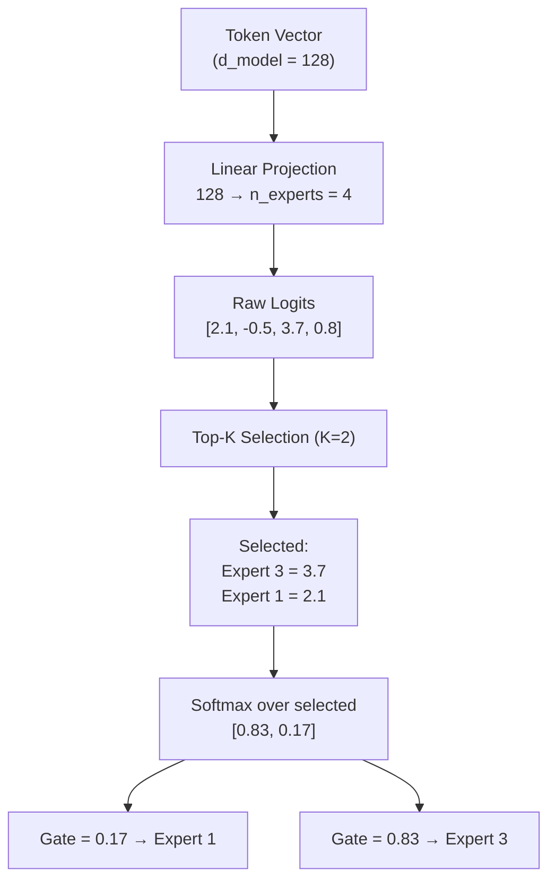

# The Router — The Brain of MoE

The router is what makes MoE *special*. For every token, it decides: **"Which experts should handle this?"**

## Top-K Routing Flow



## Step-by-Step Walkthrough

### Step 1: Linear Projection

The token vector (128 dimensions) is projected to `n_experts` (4) logits using a single learned linear layer:

```python
logits = nn.Dense(n_experts)(token)  # (128,) → (4,)
# Example: [2.1, -0.5, 3.7, 0.8]
```

### Step 2: Top-K Selection

We select the K (=2) highest-scoring experts:

```python
top_values, top_indices = jax.lax.top_k(logits, k=2)
# top_values:  [3.7, 2.1]
# top_indices: [2, 0]     (Expert 3 and Expert 1, 0-indexed)
```

### Step 3: Softmax Normalization

Softmax is applied *only* over the selected experts (not all 4), so the gate weights sum to 1.0:

```python
gates = jax.nn.softmax(top_values)
# softmax([3.7, 2.1]) = [0.83, 0.17]
```

### Step 4: Weighted Combination

Each selected expert processes the *full* token independently, and outputs are combined using the gate weights:

```python
output = 0.83 * expert_3(token) + 0.17 * expert_1(token)
```

## Why Softmax After Top-K?

:::info Important Design Choice
We apply softmax **after** top-K selection, not before. If we applied softmax first and then selected top-K, the gate weights wouldn't sum to 1.0 for the selected experts. By applying softmax only to the selected values, we ensure:

1. Gate weights sum to exactly 1.0
2. The relative importance of selected experts is preserved
3. The output is a proper convex combination
:::

## Code

```python
class Router(nn.Module):
    """Top-K gating with auxiliary load-balancing loss."""
    config: NanoMoEConfig

    @nn.compact
    def __call__(self, x):
        cfg = self.config
        logits = nn.Dense(cfg.n_experts, use_bias=False)(x)  # (B, T, E)
        top_vals, top_idx = jax.lax.top_k(logits, k=cfg.top_k)
        gates = jax.nn.softmax(top_vals)                      # (B, T, K)

        # Compute load-balancing auxiliary loss
        probs = jax.nn.softmax(logits, axis=-1)               # (B, T, E)
        mask = jax.nn.one_hot(top_idx, cfg.n_experts).max(-2)  # (B, T, E)
        f = mask.mean(axis=(0, 1))         # fraction routed to each expert
        P = probs.mean(axis=(0, 1))        # mean probability per expert
        aux_loss = (f * P).sum() * cfg.n_experts

        return gates, top_idx, aux_loss
```

## Auxiliary Loss

The router also computes a **load-balancing loss** — see the [Load Balancing](/docs/training/load-balancing) page for details.
