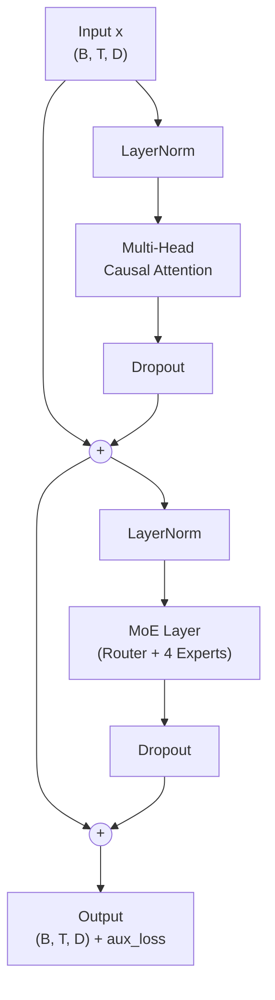
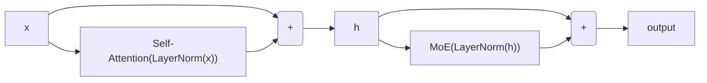
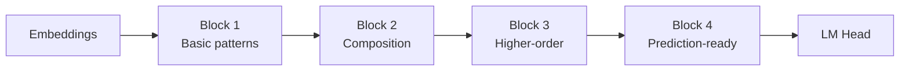

# Transformer Block

The transformer block is the main repeating unit. It combines **self-attention** (for inter-token communication) with the **MoE layer** (for per-token processing), connected through residual pathways.

## Structure



## Two Sub-layers

### Sub-layer 1: Self-Attention

```python
# Pre-norm → Attention → Residual
h = x + dropout(attention(layer_norm(x)))
```

Tokens communicate with each other. Position 5 can read from positions 1–5 to understand context.

### Sub-layer 2: MoE

```python
# Pre-norm → MoE → Residual
output = h + dropout(moe_layer(layer_norm(h)))
```

Each token is processed independently by its selected experts. **This is where MoE happens!**

## Residual Connections



:::tip Why Residual Connections?
Without residual connections, deep networks suffer from **vanishing gradients** — the gradient signal becomes too weak to update early layers. Residual connections create a "gradient highway" that allows gradients to flow directly from the loss to any layer.

In math: if `output = x + f(x)`, then `∂output/∂x = 1 + ∂f/∂x`. The `1` term ensures the gradient is always at least 1, preventing vanishing.
:::

## Code

```python
class TransformerBlock(nn.Module):
    config: NanoMoEConfig

    @nn.compact
    def __call__(self, x, deterministic=False):
        cfg = self.config

        # Sub-layer 1: Attention
        h = nn.LayerNorm()(x)
        h = MultiHeadAttention(config=cfg)(h, deterministic)
        h = nn.Dropout(cfg.dropout)(h, deterministic=deterministic)
        x = x + h  # residual

        # Sub-layer 2: MoE
        h = nn.LayerNorm()(x)
        h, aux_loss = MoELayer(config=cfg)(h, deterministic)
        h = nn.Dropout(cfg.dropout)(h, deterministic=deterministic)
        x = x + h  # residual

        return x, aux_loss
```

## Stacking Blocks

NanoMoE uses 4 blocks by default. Each block refines the representation:



Earlier blocks tend to learn **local patterns** (character combinations, common words), while later blocks learn **longer-range dependencies** (sentence structure, style).
