# NanoMoE — Mixture-of-Experts in JAX

A lightweight, educational **Mixture-of-Experts (MoE)** GPT-style language model built from scratch in **JAX / Flax**.

Inspired by [nanoGPT](https://github.com/karpathy/nanoGPT), NanoMoE replaces the standard feed-forward network in each transformer block with a **sparse MoE layer** — a set of parallel expert networks with a learned router that activates only the top-K experts per token.

## What is Mixture of Experts?

Imagine you have a team of specialists. Instead of asking *every* specialist to look at every problem, you have a **manager** who looks at each problem and says *"Expert #2 and Expert #4, you're the best fit for this — handle it."*

That's exactly how Mixture of Experts works in neural networks:

- **Experts** = independent neural networks (typically small feed-forward networks)
- **Router/Gate** = a learned module that decides which experts to use for each input
- **Sparse activation** = only a *subset* of experts run for each token

```mermaid
graph LR
    subgraph Input
        T["Token Vector"]
    end

    R["🧠 Router"]

    subgraph Experts
        E1["Expert 1"]
        E2["Expert 2"]
        E3["Expert 3"]
        E4["Expert 4"]
    end

    T --> R
    R -->|"score: 0.7"| E1
    R -->|"score: 0.3"| E4
    R -.->|"not selected"| E2
    R -.->|"not selected"| E3

    E1 --> Sum["⊕ Weighted Sum"]
    E4 --> Sum
    Sum --> Output["Output"]
```



:::tip Key Insight
In a standard transformer, *every* parameter is used for *every* token. In MoE, the model has many more total parameters, but only activates a *fraction* of them per token. This means **more capacity** without a proportional increase in **compute cost**.
:::

## Why MoE Matters

MoE is the architecture behind some of the most powerful AI models today:

| Model | Total Params | Active Params | Experts |
|-------|-------------|--------------|---------|
| Mixtral 8x7B | 46.7B | 12.9B | 8 |
| GPT-4 (rumored) | ~1.8T | ~280B | 16 |
| Switch Transformer | 1.6T | ~100B | 128 |
| DeepSeek-V3 | 671B | 37B | 256 |

**Total parameters are 3–16× larger than active parameters** — you get a bigger model that runs as fast as a smaller one.

## What's in This Documentation?

```mermaid
graph TD
    A["📖 Introduction"] --> B["🏗️ Architecture<br/>Layer-by-layer deep dive"]
    A --> C["🎓 Training<br/>Pipeline, loss, results"]
    A --> D["📚 API Reference<br/>Every class and function"]
    A --> E["🚀 Quickstart<br/>Get running in 2 minutes"]

    style A fill:#2d6a4f,color:#fff
    style B fill:#264653,color:#fff
    style C fill:#264653,color:#fff
    style D fill:#264653,color:#fff
    style E fill:#e76f51,color:#fff
```



## Default Configuration

| Parameter | Value | Description |
|-----------|-------|-------------|
| `d_model` | 128 | Hidden dimension |
| `n_layers` | 4 | Transformer blocks |
| `n_heads` | 4 | Attention heads |
| `d_ff` | 512 | Expert FFN inner dimension |
| `n_experts` | 4 | Experts per MoE layer |
| `top_k` | 2 | Active experts per token |
| `block_size` | 128 | Context window |
| `vocab_size` | 65 | Character vocabulary |

**Total parameters: ~2.4M** — small enough to train on a laptop CPU!

## Install

```bash
pip install nano-moe-jax
```

Or from source:

```bash
git clone https://github.com/carrycooldude/MoE-JAX.git
cd MoE-JAX && pip install -e .
```
