# Load Balancing — Preventing Expert Collapse

The **#1 failure mode** of MoE is **expert collapse**: without careful training, the router learns to send all tokens to one or two experts while the others sit idle.

## The Problem

```mermaid
graph LR
    subgraph Bad["❌ Expert Collapse"]
        direction TB
        R1["Router"] -->|"95%"| E1_bad["Expert 1<br/>Overloaded 😰"]
        R1 -->|"5%"| E2_bad["Expert 2<br/>Barely used"]
        R1 -.->|"0%"| E3_bad["Expert 3<br/>Dead 💀"]
        R1 -.->|"0%"| E4_bad["Expert 4<br/>Dead 💀"]
    end

    subgraph Good["✅ Balanced Routing"]
        direction TB
        R2["Router"] -->|"25%"| E1_good["Expert 1 🟢"]
        R2 -->|"25%"| E2_good["Expert 2 🟢"]
        R2 -->|"25%"| E3_good["Expert 3 🟢"]
        R2 -->|"25%"| E4_good["Expert 4 🟢"]
    end
```



### Why Does Collapse Happen?

It's a **rich-get-richer** feedback loop:
1. Router randomly favors Expert 1 early in training
2. Expert 1 gets more training data → becomes better
3. Router sends even more tokens to Expert 1 (it looks best!)
4. Other experts starve → never improve → never get selected
5. Result: expensive model that behaves like a single FFN

## The Solution: Auxiliary Loss

From the [Switch Transformer paper](https://arxiv.org/abs/2101.03961), we add a **load-balancing auxiliary loss**:

```
aux_loss = n_experts × Σᵢ (fᵢ × Pᵢ)
```

### The Two Components

| Symbol | Name | Formula | Meaning |
|--------|------|---------|---------|
| **fᵢ** | Dispatch fraction | Tokens routed to expert i / total tokens | How many tokens *actually go* to expert i |
| **Pᵢ** | Mean probability | Mean of softmax(logits)ᵢ across all tokens | How likely the router *thinks* it should send tokens to expert i |

### Why fᵢ × Pᵢ Works

The product `fᵢ × Pᵢ` is **minimized when routing is uniform**:

```mermaid
graph LR
    subgraph Uniform["Balanced: f=[0.25, 0.25, 0.25, 0.25]"]
        U["Σ fᵢ × Pᵢ = 4 × 0.0625 = 0.25<br/>aux_loss = 4 × 0.25 = 1.0"]
    end
    subgraph Collapsed["Collapsed: f=[1.0, 0.0, 0.0, 0.0]"]
        C["Σ fᵢ × Pᵢ = 1 × 1.0 = 1.0<br/>aux_loss = 4 × 1.0 = 4.0"]
    end
```



**Balanced routing gives aux_loss ≈ 1.0. Collapsed routing gives aux_loss ≈ 4.0.** Minimizing this loss pushes toward balance.

## Total Training Loss

```mermaid
graph LR
    CE["Cross-Entropy Loss<br/>(language modeling)"] --> Plus["+"]
    AUX["α × Auxiliary Loss<br/>(load balancing)"] --> Plus
    Plus --> Total["Total Loss"]
```



```python
total_loss = ce_loss + aux_weight * aux_loss
# Default: aux_weight = 0.01
```

:::warning Choosing α (aux_weight)
- **Too small** (α → 0): No balancing effect, experts may collapse
- **Too large** (α → 1): Balancing dominates, hurts language modeling quality
- **Sweet spot** (α = 0.01): Enough to prevent collapse without affecting generation quality
:::

## Code

```python
# Inside Router.__call__
probs = jax.nn.softmax(logits, axis=-1)                    # (B, T, E)
mask = jax.nn.one_hot(top_idx, n_experts).max(axis=-2)      # (B, T, E)

f = mask.mean(axis=(0, 1))    # dispatch fraction per expert
P = probs.mean(axis=(0, 1))   # mean routing probability per expert

aux_loss = (f * P).sum() * n_experts
```

## Validation: Is It Working?

In our training results, the auxiliary loss stays around **4.0** throughout training. For 4 experts, the theoretical balanced value is `4 × (4 × 0.25 × 0.25) = 4.0`. This confirms our experts are being used roughly equally! ✅
