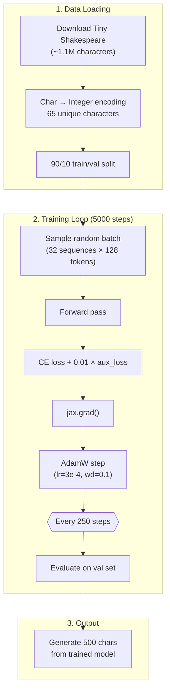

# Training Pipeline

NanoMoE uses a standard JAX training loop with `@jax.jit` compiled train/eval steps and AdamW optimizer.

## Pipeline Overview



## JIT-Compiled Steps

The entire train step (forward + backward + optimizer update) is compiled to XLA via `@jax.jit`:

```python
@jax.jit
def train_step(state, x, y, rng):
    def loss_fn(params):
        logits, aux_loss = model.apply(
            {"params": params}, x,
            deterministic=False,
            rngs={"dropout": rng}
        )
        ce_loss = cross_entropy(logits, y)
        total_loss = ce_loss + aux_weight * aux_loss
        return total_loss, (ce_loss, aux_loss)

    (loss, (ce, aux)), grads = jax.value_and_grad(loss_fn, has_aux=True)(state.params)
    state = state.apply_gradients(grads=grads)
    return state, loss, ce, aux
```

:::tip First Call Is Slow
The first `train_step()` call traces the computation graph and compiles it to XLA. This takes 10–30 seconds. All subsequent calls run the pre-compiled kernel at maximum speed.
:::

## Optimizer: AdamW

| Parameter | Value | Purpose |
|-----------|-------|---------|
| `learning_rate` | 3e-4 | Step size for parameter updates |
| `weight_decay` | 0.1 | L2 regularization (decoupled from gradient) |
| `beta1` | 0.9 | Momentum coefficient |
| `beta2` | 0.999 | Second moment coefficient |

## Evaluation

Every `eval_interval` (250) steps:
1. Sample `eval_iters` (200) batches from the validation set
2. Compute mean validation loss
3. Track best validation loss (`★` marker)
4. Log training metrics: total loss, CE loss, aux loss
