# Training Results

We trained NanoMoE on **Tiny Shakespeare** (~1.1M characters) for **5,000 steps** on CPU. Here are the actual results.

## Loss Curve

| Step | Train Loss | CE Loss | Aux Loss | Val Loss | |
|------|-----------|---------|----------|----------|-|
| 1 | 4.2320 | 4.1814 | 5.0571 | 4.0883 | |
| 250 | 2.5591 | 2.5189 | 4.0237 | 2.5524 | ★ |
| 500 | 2.4495 | 2.4094 | 4.0153 | 2.4223 | ★ |
| 750 | 2.2621 | 2.2219 | 4.0195 | 2.2626 | ★ |
| 1000 | 2.1410 | 2.1006 | 4.0342 | 2.0771 | ★ |
| 1500 | 2.0122 | 1.9718 | 4.0427 | 1.9474 | ★ |
| 2000 | 1.7739 | 1.7337 | 4.0254 | 1.8537 | ★ |
| 2500 | 1.7445 | 1.7042 | 4.0283 | 1.7919 | ★ |
| 3000 | 1.6949 | 1.6547 | 4.0210 | 1.7669 | ★ |
| 3500 | 1.6679 | 1.6275 | 4.0402 | 1.7366 | ★ |
| 4000 | 1.6298 | 1.5894 | 4.0372 | 1.7035 | ★ |
| 4500 | 1.6082 | 1.5678 | 4.0443 | 1.6801 | |
| 5000 | **1.5395** | **1.4992** | 4.0250 | **1.6584** | ★ |

## Key Observations

### 1. Rapid Early Learning
The loss drops **64%** in the first 2000 steps (4.23 → 1.77), showing the model quickly captures basic character patterns and common words.

### 2. Stable Load Balancing ✅
The auxiliary loss stays consistently around **4.0** throughout all 5,000 steps. For 4 experts, the theoretical perfectly-balanced value is exactly 4.0 — this confirms all experts are being utilized equally.

### 3. Minimal Overfitting
The train-val gap at step 5000 is only **0.12** (1.54 vs 1.66), indicating the model generalizes well despite the small dataset.

### 4. Efficient Training
**2.4M parameters** trained in approximately **4 hours on CPU** — no GPU needed for this educational demo.

## Summary

```mermaid
graph LR
    subgraph Results["Training Results"]
        direction TB
        A["📉 Loss: 4.23 → 1.54<br/>64% reduction"]
        B["⚖️ Aux loss ≈ 4.0<br/>Experts balanced"]
        C["📊 Train-Val gap: 0.12<br/>Good generalization"]
        D["⏱️ ~4h on CPU<br/>2.4M parameters"]
    end
```

## What These Numbers Mean

| Metric | Value | Interpretation |
|--------|-------|---------------|
| CE Loss 1.50 | ~4.5 perplexity | Model is ~4.5× uncertain per character |
| Aux Loss 4.0 | Balanced | All 4 experts contribute equally |
| Val − Train = 0.12 | Low overfit | Model isn't memorizing training data |

For a character-level model on Shakespeare, a loss of 1.5 produces recognizable (but imperfect) English text with Shakespeare-like vocabulary and rhythm.
